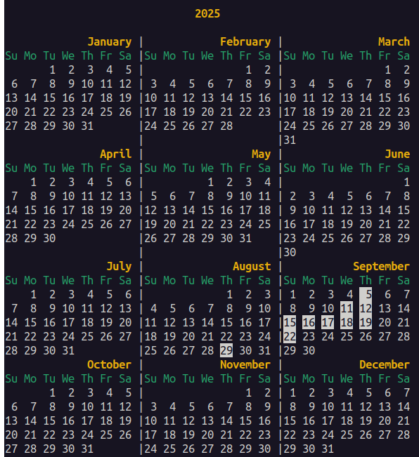

# borg-calendar

borg-calendar 是一个用于查看 [Borg Backup](https://www.borgbackup.org/) 备份记录的可视化日历工具，旨在帮助用户直观地了解备份的历史执行情况。


## 功能特点

- 以月历或年历形式展示 Borg Backup 的备份历史
- 反转高亮显示有备份记录的日期
- 支持本地和远程 Borg 仓库
- 灵活的参数配置和环境变量支持
- 自动检测备份时间范围并显示

## 安装要求

- [Borg Backup](https://www.borgbackup.org/) 1.0 或更高版本
- Bash 4.0 或更高版本
- 基本的 Unix 工具 (grep, sort 等)

## 安装步骤

1. 克隆或下载本仓库
```bash
git clone https://github.com/talenhao/borg-calendar.git
cd borg-calendar
```
2. 确保 `borg-calendar.sh` 文件具有可执行权限：
   ```bash
   chmod +x borg-calendar.sh
   ```

## 使用方法

```bash
./borg-calendar.sh [选项] [年份] [月份]
```

### 参数说明

- `年份`：要显示的年份（如 2025）
- `月份`：要显示的月份（1-12）

### 选项

- `--borg-repo PATH`：指定 Borg 仓库路径（优先级最高）

### 环境变量

- `BORG_REPO`：指定 Borg 仓库路径（优先级中等，默认是当前目录）

### 仓库路径优先级

命令行参数 > 环境变量 BORG_REPO > 当前路径

### 使用示例

```bash
# 显示从最早到最晚的所有备份月份
./borg-calendar.sh

# 使用指定的仓库路径
./borg-calendar.sh --borg-repo /path/to/repo

# 显示 2025 年全年日历
./borg-calendar.sh 2025

# 显示 2025 年 7 月
./borg-calendar.sh 2025 7

# 显示今年 7 月
./borg-calendar.sh 7
```

## 输出示例

```
📅 备份历史: 2023-01 到 2025-07
========================================
                January 2023                 
Su Mo Tu We Th Fr Sa
 1  2  3  4  5  6  7 
 8  9 10 11 12 13 14 
15 16 17 18 19 20 21 
22 23 24 25 26 27 28 
29 30 31 

                February 2023                
Su Mo Tu We Th Fr Sa
          1  2  3  4 
 5  6  7  8  9 10 11 
12 13 14 15 16 17 18 
19 20 21 22 23 24 25 
26 27 28 

...

                 July 2025                   
Su Mo Tu We Th Fr Sa
       1  2  3  4  5 
 6  7  8  9 10 11 12 
13 14 15 16 17 18 19 
20 21 22 23 24 25 26 
27 28 29 30 31 
```

有备份的日期将以反转色（背景变白，文字变黑）高亮显示。




## 工作原理

1. 脚本通过 `borg list --format '{start}{NL}'` 命令获取所有归档的创建时间
2. 解析时间信息并按年月日进行分类统计
3. 根据用户输入参数显示相应的日历视图
4. 在日历中高亮显示有备份记录的日期

注意：归档是否存在的判断基于 `{start}` 时间字段，与归档名无关。

## 注意事项

1. 确保对 Borg 仓库具有适当的读取权限
2. 对于远程仓库，确保网络连接正常
3. 脚本会缓存所有备份数据以提高性能
4. 如果没有设置 BORG_REPO 环境变量且没有通过命令行参数指定仓库路径，脚本将默认在当前目录下查找 Borg 仓库

## 许可证

请查看 [LICENSE](LICENSE) 文件了解详细信息。