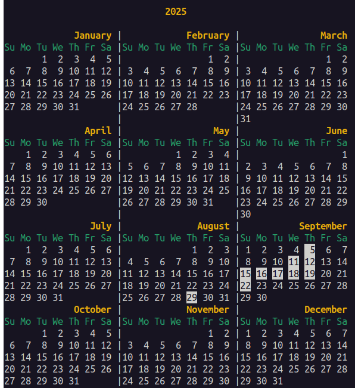
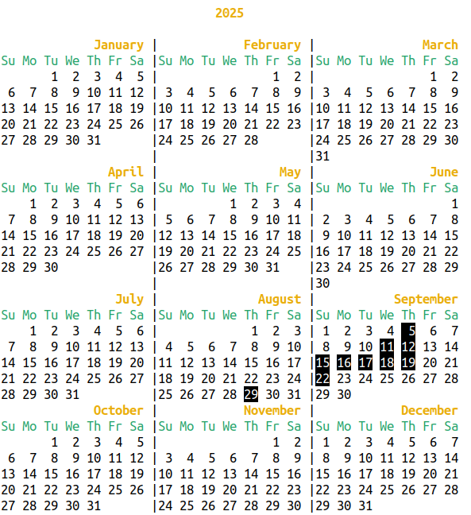

# borg-calendar

[切换到中文版](README.md)

borg-calendar is a visualization calendar tool for viewing [Borg Backup](https://www.borgbackup.org/) backup records, designed to help users intuitively understand the historical execution of backups.




## Features

- Display Borg Backup history in monthly or yearly calendar format
- Highlight dates with backups using inverted colors
- Support for both local and remote Borg repositories
- Flexible parameter configuration and environment variable support
- Automatic detection and display of backup time ranges
- Intelligent password handling to avoid exposing passwords on the command line
- Performance optimization to reduce redundant queries to Borg repository

## Requirements

- [Borg Backup](https://www.borgbackup.org/) version 1.0 or higher
- Bash 4.0 or higher
- Basic Unix tools (grep, sort, etc.)

## Installation

1. Clone or download this repository
```bash
git clone https://github.com/haotianfei/borg-calendar.git
cd borg-calendar
```
2. Ensure the `borg-calendar.sh` file has execute permissions:
   ```bash
   chmod +x borg-calendar.sh
   ```

## Usage

```bash
./borg-calendar.sh [options] [year] [month]
```

### Parameter Description

- `year`: The year to display (e.g., 2025)
- `month`: The month to display (1-12)

### Options

- `--borg-repo PATH`: Specify the Borg repository path (highest priority)
- `--help, -h`: Display help information

### Environment Variables

- `BORG_REPO`: Specify the Borg repository path (medium priority, defaults to current directory)
- `BORG_PASSPHRASE`: Borg repository password (if not set, the script will prompt for input)

### Repository Path Priority

Command line arguments > Environment variable BORG_REPO > Current directory

### Password Handling Mechanism

The script handles passwords intelligently:
- If the `BORG_PASSPHRASE` environment variable is already set, use it directly
- If not set, try to access the repository without a password
- Only prompt the user for input when it is confirmed that a password is required
- The password is valid throughout the script execution to avoid repeated input
- The password is automatically cleared when the script exits

### Help Information

You can view help information using the following command:

```bash
./borg-calendar.sh --help
```

The script displays help information according to the system locale:
- If the system locale is a Chinese environment (such as `zh_CN.UTF-8`), Chinese help will be displayed
- Otherwise, English help will be displayed

The complete help information is as follows:

```
Usage: ./borg-calendar.sh [options] [year] [month]

Display Borg Backup calendar with highlighted backup dates.

Arguments:
    year        Year to display (e.g., 2025)
    month       Month to display (1-12)

Options:
    --borg-repo PATH   Specify Borg repository path (highest priority)

Environment Variables:
    BORG_REPO   Specify Borg repository path (medium priority, defaults to current directory)

Examples:
    ./borg-calendar.sh                              # Display all backup months from earliest to latest
    ./borg-calendar.sh --borg-repo /path/to/repo    # Use specified repository path
    ./borg-calendar.sh 2025                         # Display calendar for the entire year 2025
    ./borg-calendar.sh 2025 7                       # Display calendar for July 2025
    ./borg-calendar.sh 7                            # Display calendar for July of current year

Note:
    Backup existence is determined based on the {start} time field, not the archive name.
    Repository path priority: Command line > Environment variable BORG_REPO > Current directory
```

### Usage Examples

```bash
# Display all backup months from earliest to latest
./borg-calendar.sh

# Use specified repository path (local)
./borg-calendar.sh --borg-repo /path/to/repo

# Use specified repository path (remote)
./borg-calendar.sh --borg-repo ssh://root@192.168.1.100/borg_repos/huawei_backup

# Display calendar for the entire year 2025
./borg-calendar.sh 2025

# Display calendar for July 2025
./borg-calendar.sh 2025 7

# Display calendar for July of the current year
./borg-calendar.sh 7
```

## Output Example

```
📅 Backup History: 2025-07 to 2025-09
========================================

                              2025

             January |            February |               March 
Su Mo Tu We Th Fr Sa |Su Mo Tu We Th Fr Sa |Su Mo Tu We Th Fr Sa
       1  2  3  4  5 |                1  2 |                1  2 
 6  7  8  9 10 11 12 | 3  4  5  6  7  8  9 | 3  4  5  6  7  8  9 
13 14 15 16 17 18 19 |10 11 12 13 14 15 16 |10 11 12 13 14 15 16 
20 21 22 23 24 25 26 |17 18 19 20 21 22 23 |17 18 19 20 21 22 23 
27 28 29 30 31       |24 25 26 27 28       |24 25 26 27 28 29 30 
                     |                     |31                   
               April |                 May |                June 
Su Mo Tu We Th Fr Sa |Su Mo Tu We Th Fr Sa |Su Mo Tu We Th Fr Sa
    1  2  3  4  5  6 |          1  2  3  4 |                   1 
 7  8  9 10 11 12 13 | 5  6  7  8  9 10 11 | 2  3  4  5  6  7  8 
14 15 16 17 18 19 20 |12 13 14 15 16 17 18 | 9 10 11 12 13 14 15 
21 22 23 24 25 26 27 |19 20 21 22 23 24 25 |16 17 18 19 20 21 22 
28 29 30             |26 27 28 29 30 31    |23 24 25 26 27 28 29 
                     |                     |30                   
                July |              August |           September 
Su Mo Tu We Th Fr Sa |Su Mo Tu We Th Fr Sa |Su Mo Tu We Th Fr Sa
    1  2  3  4  5  6 |             1  2  3 | 1  2  3  4  5  6  7 
 7  8  9 10 11 12 13 | 4  5  6  7  8  9 10 | 8  9 10 11 12 13 14 
14 15 16 17 18 19 20 |11 12 13 14 15 16 17 |15 16 17 18 19 20 21 
21 22 23 24 25 26 27 |18 19 20 21 22 23 24 |22 23 24 25 26 27 28 
28 29 30 31          |25 26 27 28 29 30 31 |29 30                
             October |            November |            December 
Su Mo Tu We Th Fr Sa |Su Mo Tu We Th Fr Sa |Su Mo Tu We Th Fr Sa
       1  2  3  4  5 |                1  2 | 1  2  3  4  5  6  7 
 6  7  8  9 10 11 12 | 3  4  5  6  7  8  9 | 8  9 10 11 12 13 14 
13 14 15 16 17 18 19 |10 11 12 13 14 15 16 |15 16 17 18 19 20 21 
20 21 22 23 24 25 26 |17 18 19 20 21 22 23 |22 23 24 25 26 27 28 
27 28 29 30 31       |24 25 26 27 28 29 30 |29 30 31
```

Dates with backups are highlighted with inverted colors (white background, black text).

## How It Works

1. The script retrieves all archive creation times using the `borg list --format '{start}{NL}'` command
2. Parses the time information and categorizes it by year, month, and day
3. Displays the appropriate calendar view based on user input parameters
4. Highlights dates with backup records in the calendar

Note: Backup existence is determined based on the `{start}` time field, not the archive name.

## Performance Optimization

The script employs multiple performance optimization strategies:
- Uses global caching to avoid repeated execution of the `borg list` command
- Combines password checking and data retrieval into a single command execution
- Executes the `borg list` command at most once during the entire script execution cycle

## Notes

1. Ensure appropriate read permissions for the Borg repository
2. For remote repositories, ensure network connectivity
3. The script caches all backup data to improve performance
4. The script optimizes `borg` command execution to reduce system overhead
5. If the BORG_REPO environment variable is not set and no repository path is specified via command line arguments, the script will default to looking for a Borg repository in the current directory

## License

See the [LICENSE](LICENSE) file for details.